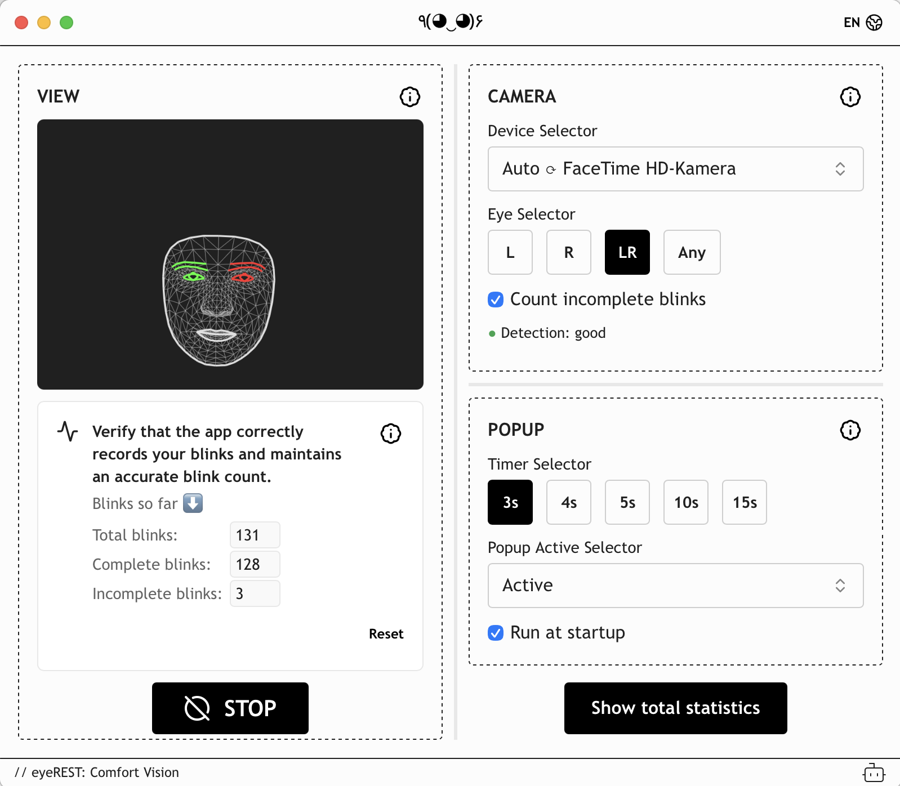
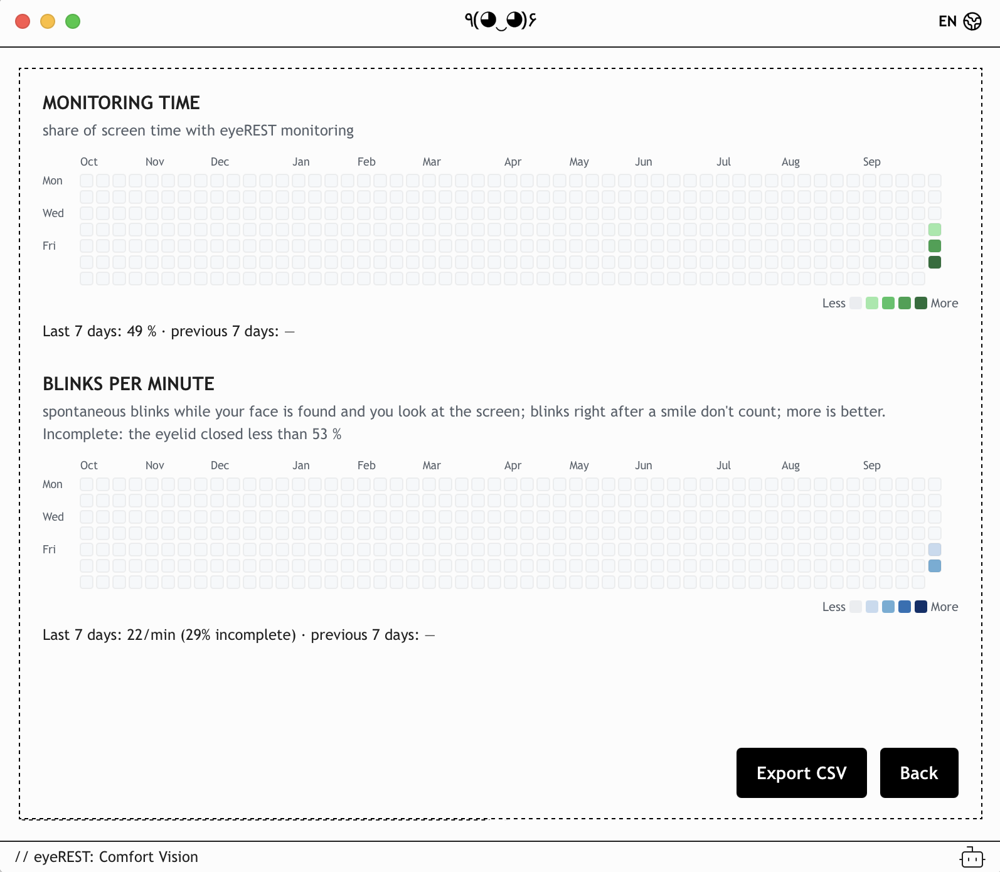
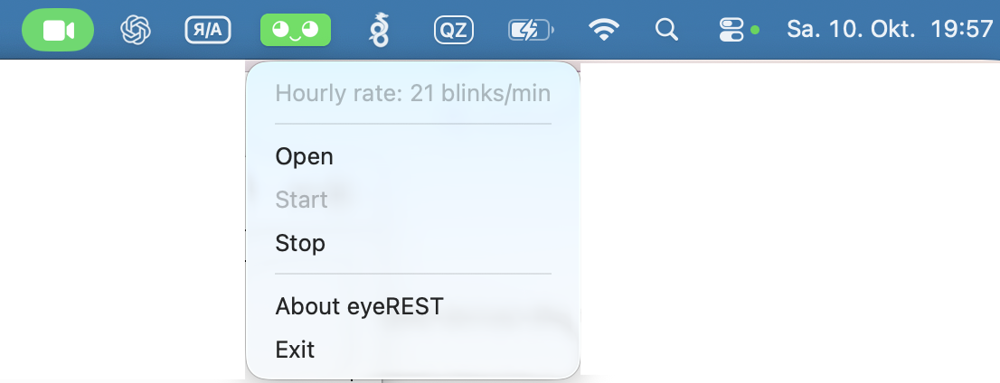

# eyeREST patch

> Unofficial. Not affiliated with or endorsed by the makers of eyeREST. This repository contains only the patch; you need your own copy of eyeREST from the Mac App Store. Patching re-signs the app ad hoc, and macOS will treat it as a different app (camera permission is asked again).

Patches the Mac App Store build of **eyeREST** (`com.vinlemon.eyeREST`, tested with 0.2.0 / build 20241021.195631). Everything the patch adds follows the app's language (English, German, Italian, Spanish, Russian, Japanese, Chinese).

| Main window | Statistics | Menu |
|---|---|---|
|  |  |  |

## Features

### App, window and menu

- **Menu-bar only.** No Dock icon; the app lives in the menu bar (the glasses icon).
- **Starts hidden, monitoring on.** At launch the main window stays hidden and monitoring starts by itself, even if it was stopped before quitting. The window does show at launch while the camera permission or the app's first-run intro is still pending.
- **Run at startup** checkbox at the bottom of the Popup section, which is only as tall as its content. eyeREST then starts at login, and it appears in System Settings → General → Login Items. If macOS asks you to allow it there, the checkbox says so. The app's own autostart can't work inside the macOS sandbox.
- **Glasses icon menu** (left or right click):
  - a non-clickable line with the **hourly rate**: blinks per minute over the last hour (a sliding 60-minute window over usable time), shown as soon as there is any usable time;
  - **Open**, **Start** and **Stop** (greyed out when they don't apply);
  - **About eyeREST** (the app's info page; monitoring resumes after Close);
  - **Exit**.

  The menu follows the system appearance, not the menu bar's.
- **Window buttons.** The yellow button hides the window (bring it back with **Open**, or by opening eyeREST again while it runs). The red button quits.
- **Exit asks for confirmation**, from the menu and from the red button. Return quits and Esc cancels. Logging out or shutting down isn't held up.
- Reopening the window always shows the main view, even if the statistics were open before.

### Camera and monitoring

- **Automatic camera.** The camera dropdown gets a first entry, **"Auto ⟳ <camera in use>"**. While it's selected, eyeREST uses a connected external camera, or the built-in one if there isn't one. Plugging a camera in or out (also detaching a display with a camera and opening the lid) restarts monitoring with the new camera. On the first launch of the patched app, the saved camera is switched to Auto once.
- **Eye selection "Any"** next to L / R / LR: a blink counts when either eye closes. Best when the camera sees you at an angle and one eye looks much smaller.
- **Detection quality** below the eye selection: good, fair or poor, with a hint when it isn't good.

### The smile

- **Shows over full-screen apps** (VSCode, browsers, …).
- **Always centered** on the screen you're working on, also after switching displays.
- **Stays up while no face is detected** (while monitoring), so you notice you've drifted off-camera. It floats above other apps but below eyeREST's own window while you use it.
- **"Adjust the camera angle"** appears under it (small grey text) after a full minute of poor detection quality with your face in view.
- **4-second timer** between 3s and 5s. Choosing it reloads the app's page (about 2 s), since the app reads its settings only at start; monitoring restarts by itself.
- **"Count incomplete blinks"** checkbox below the eye selection, checked by default. Checked: every blink dismisses or postpones the smile, and blinks the patch sees but the app's own detector misses are passed on to the app. Unchecked: only complete blinks count, which trains complete blinking.

### Blink counters

Below "Count your blinks here", instead of the app's single counter, there are three aligned counters: **Total blinks**, **Complete blinks** and **Incomplete blinks**. An **i** in the card's corner, like the app's own info buttons, opens a dialog explaining what each counts, how it's defined and why it matters.

- Total = complete + incomplete. All three come from the patch's own detection and count since monitoring started.
- **Reset** (right-aligned below the counters) zeroes them and the app's own counter. The statistics aren't affected.
- The start/stop button is lower, so everything fits in the fixed-size window.

### Statistics

**Show total statistics** (the button below the Popup section, the same height as start/stop and level with it) opens two GitHub-style grids covering the past year, one square per day. Hovering a square shows that day's value:

- **Monitoring time:** the share of the day's screen-on time with monitoring running, e.g. "63 % (4 h 12 min of 6 h 40 min)". Screen-on time comes from the macOS power log (`pmset -g log`), so time when eyeREST wasn't running counts too. Time with the screen asleep or locked isn't counted as monitoring.
- **Blinks per minute:** all spontaneous blinks, with the share of incomplete ones, e.g. "14/min, 38% incomplete". More is better; at a screen the rate typically drops well below the normal 15 to 20. Only time while your face is found and you look at the screen counts. Blinks right after a smile are left out (the first one after it, and any within 3 s), because they answer the smile. A day needs 5 minutes of such time to get a value.

Below each grid are the averages for the last 7 days and the 7 days before. They're weighted by time and use only days that show a value themselves. **Export CSV** saves one row per recorded day to a file you choose: date, screen and monitoring minutes, monitoring share, measured blink minutes, total / complete / incomplete blinks, blinks per minute and incomplete share. **Back** returns to the main view. Recording starts when the patched app first runs; earlier days show as "no data".

### Blink and gaze detection

The app's face model (MediaPipe Face Landmarker, about 13 frames per second) builds 478 face points (468 face + 10 iris) per frame by pushing them one by one into an array. A wrapper around `Array.prototype.push` picks up the array when its 478th point arrives.

- **Blink:** the eye aspect ratio (EAR = eyelid gap / eye width, in 3D with MediaPipe's z; points 33/160/158/133/153/144 and 362/385/387/263/373/380), relative to its usual value, which follows open-eye frames over about 2 s.
  - Which eye counts follows the eye selection: **L** or **R** only that eye (MediaPipe's left eye, points 362…, or its right eye, points 33…, the same mapping the app uses); **LR** both together (average, as in the app); **Any** whichever eye closes further.
  - A blink means the eye drops below 55 % and opens again (above 80 %) within 800 ms. Below 47 % it's **complete**, otherwise **incomplete**. Shallower eyelid movements aren't counted: they blend into slow eyelid movements while reading and looking around.
  - The thresholds come from 2 × 20 counted blinks: found 20 and 21, with 2 false detections in 70 s of reading or holding the eyes open. A threshold derived automatically (Otsu) was tried and dropped. Depending on the recording it landed at 54 % or 61 %, which changed the rate by about a third.
- **Looking down:** head pitch in degrees from the forehead (10) and chin (152) points in 3D, compared with the usual pitch for the camera in use (the 30th percentile of the last 5 minutes). A camera above the screen sees you looking down all the time, so a fixed threshold doesn't work. 12° above the usual pitch counts as looking down; in a test, writing on paper was about +25° and the keyboard about +15°. Irises clearly lower in the eyes (0.12 eye widths) count too. Frames up to 1.5 s after looking down don't count either.
- **Passing blinks to the app:** the app shows the smile when its own rule (an eyeBlink blendshape score 0.2 above the average since its last blink) sees no blink for the timer duration. It reads those scores through `Array#filter` (LR) / `#find` (L, R) once per frame, and the patch wraps both.
  - **Count incomplete blinks** checked: the app's rule is replayed, and a blink detected here that the app didn't count within 700 ms is handed to it as scores of 1 on the next frame.
  - Unchecked, or with **Any** (for which the app's own lookup finds no eye): the app gets a neutral score of 0.01 between blinks, and only blinks detected here are handed to it (only complete ones when unchecked). A 0 would be skipped by the app, and with only 1s its average would be 1, so no blink would stand out.
- **Detection quality,** from geometry only, with no per-person calibration. It uses the open eyelid gap in camera pixels (which covers distance, camera angle and resolution) and the head angle to the camera (sideways from face edges 234/454, up/down from forehead/chin), both as medians over the last minute.
  - **Good:** at least 9 px and under 15°. **Fair:** 6 to 9 px or 15 to 25°. **Poor:** under 6 px or over 25°.
  - The face model places points to within about 1 to 2 px, so in a small gap an incomplete blink barely shows.
  - The smile window's note reads `localStorage['fsaux-quality']`, written by the main window, through the `storage` event. When the face is lost, the measurement starts over and the note disappears, so being away, sitting down or getting up never triggers it.
- The log shows a `face:` line every 10 s while monitoring, with frames, pitch, iris, EAR, and detected/counted blinks.

## Quick start

```bash
git clone https://github.com/sergeyvilov/eyerest-patch.git && cd eyerest-patch
./patch.sh            # builds ./eyeREST.app from /Applications/eyeREST.app
./install.sh          # replaces /Applications/eyeREST.app (asks for sudo password)
```

After an App Store update, run the same two commands again. `patch.sh` refuses to patch an app that is already patched.

To go back to the original:

```bash
./install.sh restore  # reinstalls ./eyeREST.app.orig
```

You can also delete the app and reinstall it from the App Store.

After installing, macOS will probably ask for **camera access** again, because the code signature changed. It may also ask once whether eyeREST may access its own data ("data from other apps"). Allow both.

### Requirements

- Xcode Command Line Tools (`clang`, `codesign`, `otool`): `xcode-select --install`
- `python3` (any version, standard library only)

## Files

| File | Purpose |
|---|---|
| `fsaux.m` | Source of the injected library (`libfsaux.dylib`): window, Dock and button changes, plus injecting the JS below |
| `fsaux-inject.js` | JavaScript injected into the app's WebViews: Auto camera, no-face smile, start/stop, blink detection, counters, statistics and the added controls (main window), and the camera-angle note (smile window). Copied to `Contents/Resources/`, so you can edit it and re-run `patch.sh` without touching the C code |
| `insert_dylib.py` | Adds an `LC_LOAD_DYLIB` load command for the library to every slice of the `eyerest` binary |
| `ents.plist` | Entitlements for the ad-hoc re-signature: sandbox, camera, network client, read-only access to `/private/var/log/powermanagement/` (for screen time), and read/write access to files the user picks in a save dialog (CSV export) |
| `patch.sh` | Full pipeline: back up, compile, inject, edit Info.plist, re-sign |
| `com.vinlemon.eyeREST.fsaux-autostart.plist` | Login item for "Run at startup", copied to `Contents/Library/LaunchAgents/`. It runs the app's binary with `--fsaux-autostart` |
| `screenshots/` | The screenshots above |
| `install.sh` | Copies the patched app (or `restore`: the original) into `/Applications` |
| `eyeREST.app.orig` | Untouched backup of the original app (made by `patch.sh`, not in the repository) |
| `frontend/` | Local dump of the app's web frontend (minified JS/CSS), used to find the hooks below. Not in the repository, because it is the app's own code |

## How it works

eyeREST is a **Tauri 2** app: Rust using `tao` windows plus a WebKit UI. All of its window handling goes through standard AppKit `NSWindow`/`NSApplication` methods, so the patch is a small Objective-C library loaded into the process at startup. It replaces a few methods with `method_setImplementation`, and the Rust binary is otherwise unchanged.

### Why the smile was hidden over full-screen apps

The smile is a borderless 250×200 `TaoWindow` that the app marks as always-on-top, which in AppKit is `setLevel:` at floating level. A full-screen app runs in its own Space, and macOS only shows another app's window there if all of these are true:

- the window's `collectionBehavior` includes `CanJoinAllSpaces` + `FullScreenAuxiliary` (and not `FullScreenPrimary`),
- its window level is high enough,
- the app is an **agent/accessory app** (no Dock icon). Fixing the window alone was not enough in practice.

### What `libfsaux.dylib` hooks

| Method | Change |
|---|---|
| `-[NSWindow setLevel:]` | For Tao windows set above normal level (the smile): raise to `NSStatusWindowLevel` and set `CanJoinAllSpaces \| FullScreenAuxiliary \| Stationary \| IgnoresCycle`, clearing `FullScreenPrimary/None/MoveToActiveSpace/Managed` |
| `-[NSWindow setCollectionBehavior:]` | Keeps those flags on that window if the app resets them later |
| `-[NSApplication setActivationPolicy:]` | Always forces `NSApplicationActivationPolicyAccessory`, so the app's own "show in Dock" setting can't bring the Dock icon back |
| `-[NSWindow orderOut:]` | For the main window: quit the app (see below) |
| `-[NSWindow performClose:]`, `-[NSWindow close]` | For the main window: quit. Not used by 0.2.0; kept in case a later version switches to a real close |
| `-[NSWindow miniaturize:]`, `-[NSWindow performMiniaturize:]` | For the main window: hide it (`orderOut:` without going through the hook above) instead of minimizing it |
| `-[NSWindow isMiniaturized]` | Returns YES for the window hidden by minimize |
| `-[NSWindow deminiaturize:]` | For that hidden window: activate the app and `makeKeyAndOrderFront:` it |
| `-[WKWebView initWithFrame:configuration:]` | Adds `fsaux-inject.js` as a user script plus a `fsaux` script-message handler (see below) |
| `TaoTrayTarget` `mouseDown:` / `rightMouseDown:` (`mouseUp:` variants ignored) | Shows the patch's menu instead of the app's own click handling. Installed with `class_replaceMethod` once the class exists, because the app creates it at runtime |
| `-[NSWindow orderWindow:relativeTo:]`, `-[NSWindow orderFrontRegardless]` + `NSApplicationDidChangeScreenParametersNotification` | Every time the overlay is shown, and whenever the display setup changes, it is re-centered on `NSScreen.mainScreen` (the screen with the active app's focused window). The app itself centers it only once, at launch |
| `NSWorkspaceScreensDidSleep/Wake`, `com.apple.screenIsLocked/Unlocked` | Tell the JS when the screen is off or locked; monitoring time isn't counted then |
| `{cmd: 'screentime'}` message | Runs `/usr/bin/pmset -g log` and adds up "Display is turned on" → "off"/sleep intervals per local day. Then it calls `window.__fsaux.screenTime({first, days})`. macOS keeps only about a week of this log, so the JS stores each day it receives in `localStorage['fsaux-stats']`, together with monitoring time and blink counts |
| Overlay hidden → visible (in the `orderWindow:` hooks above) | Calls `window.__fsaux.smileShown()`. Blinks right after it aren't counted as spontaneous |
| `{cmd: 'export', name, data}` message | Shows a save panel and writes the CSV to the chosen file |
| `{cmd: 'autostart', on}` message | Registers/unregisters the login item with `SMAppService agentServiceWithPlistName:` and reports the state back via `window.__fsaux.autostartState()` |
| Every launch | `-orderWindow:relativeTo:` / `-orderFrontRegardless` don't show the main window until **Open**. It counts as minimized, and ghosting it for the camera still works. The JS sends `{cmd: 'menu', item: 'open'}` if `settings.global.permission` isn't `granted` or the intro (`presentation`) is pending |
| App delegate `applicationShouldHandleReopen:hasVisibleWindows:` (added or replaced once the delegate exists) | Opening the running app again runs **Open** |
| Library constructor | If eyeREST is already running, the new copy quits right away. This covers registering the login item, which also launches it immediately |
| Notifications: window became/resigned key, app became/resigned active | While eyeREST is active and its main window is key, that window's level is `NSStatusWindowLevel + 1`, just above the smile. Otherwise it goes back to normal level, so it doesn't float over other apps |

**Overlay** = the first Tao window the app itself makes always-on-top (the 250×200 smile window). **Main window** = any other Tao window (the 800×700 settings/stats window). The menu-bar icon window is an `NSStatusBarWindow`, so none of the window hooks touch it.

#### How the main window's buttons work (found by tracing)

The main window has **no native title bar**. Its red/yellow/green buttons are HTML calling Tauri's JS window API:

- **Yellow → `minimize()`** → `miniaturize:`. The hook hides the window instead.
- **Red → `hide()`** → `orderOut:`. The hook quits instead. Neither launching the app nor clicking STARTEN calls `orderOut:` on the main window, so this only fires from the red button.
- **The glasses icon** (the app's original handling, now replaced by the menu) asks `isMiniaturized`. If the answer is YES it calls `deminiaturize:`; otherwise it does nothing. That's why the hidden window is reported as minimized, and why `deminiaturize:` shows it. The menu's **Open** handles that hidden window directly.

Quitting: `orderOut:` runs inside tao's event handler, which holds a lock that `-[NSApplication terminate:]` also needs. Calling terminate there deadlocks, so the hook hides the window, schedules `terminate:` with `dispatch_async` on the main queue, and calls `exit(0)` after 2 s as a fallback.

### The injected JavaScript (`fsaux-inject.js`)

The frontend is a SolidJS app. These details come from the dump in `frontend/main-*.js`:

- Settings are in `localStorage["settings"]` as `{global: {deviceId, …}, config: {popupStatus, timerDuration, eyeStatus}}`.
- The camera dropdown lists `navigator.mediaDevices.enumerateDevices()` once, when it loads. If the saved `deviceId` isn't in the list, it selects the **first** entry.
- Monitoring opens the camera with `getUserMedia({video: {deviceId: {exact: id}, …}})` and keeps that stream until STOPP.
- While no face is found, the app hides the container of `<canvas id="canvas-face-detector">` (with a 2 s debounce), shows a "face not found" card, and hides the popup.
- The smile window is shown or hidden with the Rust commands `show_blink_popup` / `hide_blink_popup` (no arguments), via `window.__TAURI_INTERNALS__.invoke`.

What the script does in the main page (in the smile window it only shows the camera-angle note):

- **Auto camera:** `enumerateDevices` is wrapped to add a virtual first device `fsaux-auto`, and `getUserMedia` maps that ID to the best real camera. "Best" means the first camera whose label isn't built-in (`BUILTIN` regex: FaceTime/MacBook/iMac/…) and isn't in `IGNORE` (Desk View, virtual cameras, …), otherwise the built-in camera. On `devicechange` (debounced, since several arrive at once on wake), or when the camera's track ends, monitoring is stopped and started again if the best camera changed, which makes the app open the new camera. Swapping the track under the running detector left it without frames. A `MutationObserver` keeps the "Auto ⟳ …" label current. If no labels are available yet (WebKit hides them until the camera has been used once), the script opens and immediately stops the camera once to unlock them.
- **One-time migration:** sets `settings.global.deviceId = "fsaux-auto"` once and records `localStorage["fsaux-auto-migrated"]`. Delete that key to run the migration again.
- **No-face smile:** every 1.5 s, if the detector canvas exists inside a `[hidden]` element (monitoring on, no face) and the pop-up setting isn't Disabled, it calls `show_blink_popup`. When the face comes back, it calls `hide_blink_popup` once; after that the app's normal blink timer is in charge again. Showing the popup doesn't take focus from the app you're working in.
- **Start/stop:** the start/stop control is the page's only `button.button--size_2xl`, and monitoring is running while `#canvas-face-detector` exists. After every launch the script clicks Start once the button is enabled, even after a manual Stop. It exposes `window.__fsaux.start()/stop()/running()/about()` for the menu, and reports `{cmd: 'state', running, lang, rate}` to native code: running state (greys out Start or Stop), the app's language and the hourly blink rate for the menu.
- **Camera requests while the window is hidden:** WebKit only grants `getUserMedia` while the page's window is on screen; otherwise the request just waits, with no error. So Start from the menu with the window minimized used to leave the camera off. Turning off WebKit's private `getUserMediaRequiresFocus` preference didn't help. Instead, the JS sends `{cmd: 'ghost', on: true/false}` around every camera request made while `document.hidden`. Meanwhile `fsaux.m` puts the main window on screen with alpha 0, click-through, using `orderFrontRegardless` (no app activation), then hides it again. It clears the "hidden by minimize" marker during that time; otherwise AppKit would treat ordering it front as un-minimizing, and the `deminiaturize:` hook would activate the app. A 10 s safety net hides the window again if a request never finishes. Camera switching on plug/unplug uses the same mechanism.
- **Timers run in a Web Worker.** WebKit pauses page timers while the window is hidden, but Worker timers keep running. The app's own face detector uses the same trick.

The `fsaux` message handler accepts `{cmd: 'log', msg}` (written to the log as `JS …`), `{cmd: 'state', running, lang, rate}`, `{cmd: 'ghost', on}`, `{cmd: 'screentime'}`, `{cmd: 'autostart', on}`, `{cmd: 'export', name, data}`, `{cmd: 'menu', item: 'open'|'start'|'stop'|'about'|'exit'}` (runs a menu action without clicking, handy for scripted tests), `{cmd: 'windows'}` (logs every window and its view tree with frames), and `{cmd: 'write', name, data}` (writes a file to `…/Data/tmp/fsaux-dump/`). To re-dump the frontend after an update, temporarily put this in `fsaux-inject.js`:

```js
window.addEventListener('load', async () => {
  const post = (o) => window.webkit.messageHandlers.fsaux.postMessage(o);
  for (const el of document.querySelectorAll('script[src], link[rel=stylesheet], link[rel=modulepreload]')) {
    const url = el.src || el.href;
    post({cmd: 'write', name: url.split('/').pop(), data: await (await fetch(url)).text()});
  }
});
```

### Bundle changes made by `patch.sh`

1. `codesign --remove-signature` on `Contents/MacOS/eyerest`.
2. `insert_dylib.py` writes `LC_LOAD_DYLIB @executable_path/libfsaux.dylib` into the free space after the Mach-O load commands of both slices (x86_64 + arm64) and updates `ncmds`/`sizeofcmds`. It checks that there is room, and there is several KB.
3. Copies `libfsaux.dylib` (universal) to `Contents/MacOS/` and `fsaux-inject.js` to `Contents/Resources/`.
4. Sets `LSUIElement = true` in `Contents/Info.plist`, so the app starts with no Dock icon.
5. Removes `Contents/_MASReceipt`, because the receipt is tied to the original signature.
6. Re-signs everything **ad hoc** (`codesign -s -`) with `ents.plist`.

### Why this re-signing works

- The original binary has **no hardened runtime** (`flags=0x0`), so library validation doesn't apply and an ad-hoc-signed injected library loads fine.
- The original entitlements include `com.apple.application-identifier`, `com.apple.developer.team-identifier` and `keychain-access-groups`. These are restricted: an ad-hoc-signed app that claims them is killed at launch. `ents.plist` keeps only `app-sandbox`, `device.camera` and `network.client`, and adds two that ad-hoc apps may use: read-only access to the power log (temporary exception) and access to files picked in a save panel.
- The app stays **sandboxed** with the same bundle ID, so it keeps using its existing container at `~/Library/Containers/com.vinlemon.eyeREST/` and your settings carry over.
- `/Applications/eyeREST.app` is owned by root (installed by the App Store), so the patched app is built in this folder and copied over with `sudo`.

## Debugging

The library writes a line every time it acts to

```
~/Library/Containers/com.vinlemon.eyeREST/Data/tmp/fsaux.log
```

for example `setLevel(top) TaoWindow … level=25 cb=0x151`, `miniaturize->hide`, `deminiaturize->show`, `orderOut->quit`, `JS auto camera -> FaceTime HD-Kamera`, `JS no face -> showing smile`, `tray menu installed`, `JS auto start`, `JS user stop`, `state running`, `menu exit->quit`, `ghost show (camera request while hidden)` / `ghost hide`, `overlay centered`, `started by login item`, `launch: main window kept hidden`, `reopen -> open main window`, `autostart on/off: ok`, `already running (pid N), quitting`, `screen time: N bytes of log, N days from <date>`, `JS face: …`, `JS detection quality …`, `JS camera change -> restarting monitoring with …`, `JS about closed -> monitoring resumed`, `export <path>: ok`. Each line ends with the window's current level, which is useful for checking the stacking.

- **Nothing is logged at all:** the library didn't load. Check `otool -L eyeREST.app/Contents/MacOS/eyerest | grep fsaux` and `codesign -vv eyeREST.app`.
- **The app crashes at launch after an update:** run `log show --last 2m --predicate 'process == "eyerest"' | grep -iE "dyld|amfi|sandbox"`. Usual causes: a new version needs an entitlement that `ents.plist` doesn't have (compare it with `codesign -d --entitlements - eyeREST.app.orig`), or not enough header space for the load command (`insert_dylib.py` stops with an error in that case). The hardened runtime is not a problem: re-signing without `--options runtime` turns it off.
- **The close/minimize buttons don't behave as described:** if clicking them adds no `miniaturize->hide` / `orderOut->quit` line to the log, a new version calls something else. To find out what, temporarily add logging hooks for more `NSWindow` methods (`makeKeyAndOrderFront:`, `orderFront:`, `isVisible`, …) in the same style as the existing ones, rebuild, and click again.
- **Testing the glasses icon from a script:** an Accessibility "click" on the menu-bar item does *not* trigger the app's handler; only a real mouse event does (for example a `CGEvent` posted to `.cghidEventTap`).
- **The Auto camera picks the wrong device:** adjust the `BUILTIN` / `IGNORE` regexes at the top of `fsaux-inject.js`. The labels are the names shown in the dropdown.
- **No "Auto ⟳" entry, or the smile doesn't stay up after an update:** the frontend changed. Re-dump it (see above) and check the facts listed under *The injected JavaScript*. Missing `JS inject ready` in the log means the script wasn't injected at all.
- **The page can't call some Tauri commands:** the app's permission rules (ACL) allow only some commands from the page. For example `plugin:window|unminimize` is rejected, while `minimize`, `hide`, `show_blink_popup` and `hide_blink_popup` are allowed.
- **The glasses icon no longer opens the menu:** check the log for `tray menu installed`. If it's missing, the tray view class was renamed; log the view tree with `{cmd: 'windows'}` and look under `NSStatusBarButton`.
- **The camera stays off after Start while the window is hidden:** look for a `ghost show` / `ghost hide` pair around `JS auto camera -> …`. If `ghost show` appears but no camera line follows, WebKit's capture rules changed.
- **Auto-start doesn't happen:** the log should show `JS auto start` a few seconds after launch. If it doesn't, the app's start button probably changed; adjust `toggleButton()` in `fsaux-inject.js`.
- **Window class names change** (the hooks match class names starting with `Tao`): look at the log and adjust `fsaux_isTao` in `fsaux.m`.

To test a build without installing it, run `open ./eyeREST.app` (quit the installed one first).
